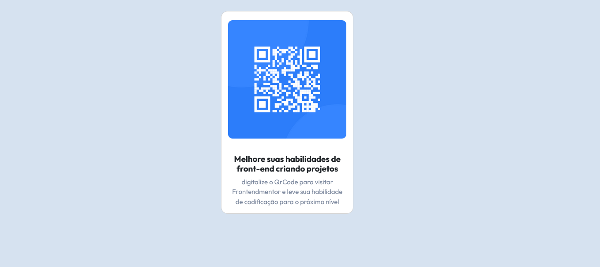

### Frontend Mentor - QR code component solution

Essa é uma solução para o desafio [QR code component challenge on Frontend Mentor](https://www.frontendmentor.io/challenges/qr-code-component-iux_sIO_H). Os desafios do Frontend Mentor ajudam você a aprimorar suas habilidades de codificação, construindo projetos realistas.

### Tabela de conteudo

- [Visao geral](#visao-geral)
  - [Captura do projeto](#captura-do-projeto)
  - [Links](#links)
- [Meu Processo](#meu-processo)
  - [Construido com](#construido-com)
  - [O que aprendi](#o-que-aprendi)
  - [Desenvolvimento contínuo](#desenvolvimento-contínuo)
  - [Recursos úteis](#recursos-úteis)
- [Autor](#autor)


## Visao geral

### Captura do projeto




### Links

- Solution URL: [Código](https://your-solution-url.com)
- URL Site: [Deploy](https://qr-code-frontend-mentor-zeta-blue.vercel.app/)

## Meu Processo

### Construido com

- HTML5 semântica
- Propriedades personalizadas em CSS
- Flexbox
- CSS Grid
- Bootstrap
- Fluxo de trabalho mobile-first


### O que aprendi

Com esse projeto aprendi a fazer uso melhor do framework: Bootstrap. Junto com as técnicas de estilização e criação de variáveis com CSS.

**HTML**
```html
<div class="col">
        <div class="card card-center" style="width: 20rem;">
          
          <div class="card-body">
            <h5 class="card-title">Melhore suas habilidades de front-end criando projetos</h5>
            <p class="card-text">digitalize o QrCode para visitar Frontendmentor e leve sua habilidade de codificação
              para o próximo nível</p>
          </div>
        </div>
  </div>
```
**CSS**
```css
:root {
    --White: hsl(0, 0%, 100%);
    --lightgray: hsl(212, 45%, 89%);
    --Grayishblue: hsl(220, 15%, 55%);
    --Dark_blue: hsl(218, 44%, 22);
}
```


### Desenvolvimento contínuo

Pretendo me aperfeiçoar na utilização do framework: Bootstrap. Hoje ele é bem utilizado na parte de posicionamentos dos elementos da tela pois uma das formas que ele faz com que a nossa página passe a se divida entre colunas.

### Recursos úteis

- [Bootstrap](https://getbootstrap.com/docs/5.3/layout/grid/) - A utilização desse framework me auxilio na distribuição dos elementos pela tela.
- [Variaveis CSS](https://developer.mozilla.org/pt-BR/docs/Web/CSS/Using_CSS_custom_properties) - Me ajudo com a criação de variávies no CSS, onde não preciso ficar declarando os mesmo valores toda hora! Posso apenas declarar uma unica vez e chama-las quando necessário


## Autor

- GitHub - [Matheus](https://github.com/DevMatheusBarba)
- Frontend Mentor - [Matheus](https://www.frontendmentor.io/profile/DevMatheusBarba)

